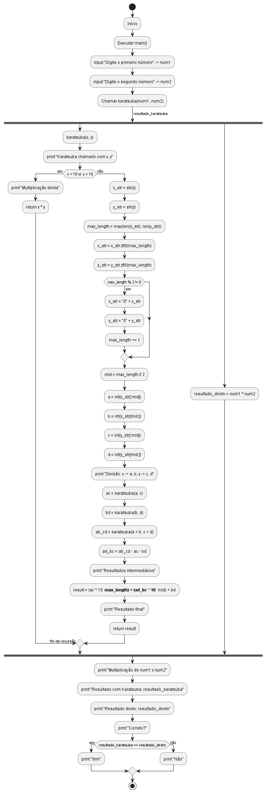
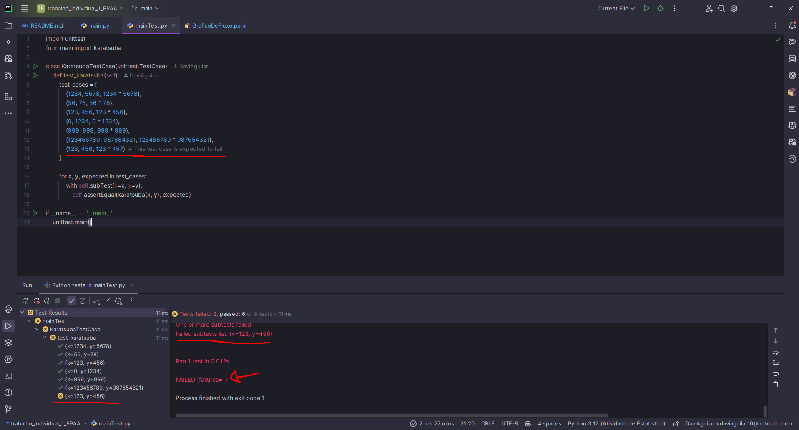
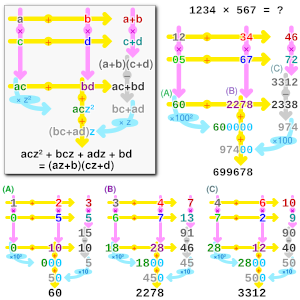

# Algoritmo de Karatsuba  

## Descrição  

Este projeto implementa o **Algoritmo de Karatsuba**, uma técnica eficiente para multiplicação de dois números inteiros grandes. O método reduz a complexidade da multiplicação de **O(n²)** para aproximadamente **O(n^1.585)**, tornando-o mais eficiente que a multiplicação tradicional para números grandes.  

## Funcionamento do Algoritmo  

O Algoritmo de Karatsuba segue os seguintes passos:  

1. **Caso Base**: Se os números possuem apenas um dígito, a multiplicação é feita diretamente.  
2. **Divisão**: Os números são divididos ao meio:  
   - \( x = 10^m \cdot a + b \)  
   - \( y = 10^m \cdot c + d \)  
3. **Recursão**: São realizadas três multiplicações menores:  
   - \( ac \)  
   - \( bd \)  
   - \( (a+b)(c+d) - ac - bd \)  
4. **Combinação**: Os resultados são combinados para obter o produto final:  
   \[
   resultado = (ac \times 10^{2m}) + ((a+b)(c+d) - ac - bd) \times 10^m + bd
   \]  

## Estrutura do Projeto  

O repositório contém os seguintes arquivos:  

```
📂 karatsuba-project  
│── 📄 main.py              # Implementação do algoritmo  
│── 📄 README.md            # Documentação do projeto 
│── 📄 mainTest.py          # Teste do algoritmo 
│── 📄 img.png              # Imagem do teste
│── 📄 img_2.png            # Representação gráfica do algoritmo
│── 📄 GraficoDeFluxo.png   # Grafico de fluxo
│── 📄 GraficoDeFluxo.puml   # Código do grafico de fluxo

```

## Como Executar  

### 1. Clonar o Repositório  

```sh
git clone https://github.com/DaviAguilar/trabalho_individual_1_FPAA.git
cd trabalho_individual_1_FPAA
```

### 2. Executar o Script  

```sh
python main.py
```

### 3. Exemplo de Uso  

Entrada:  
```
Digite o primeiro número: 556677  
Digite o segundo número: 889922
```
Saída esperada:  
```
Karatsuba chamado com x = 556677, y = 889922
Divisão: x = 556677 -> a = 556, b = 677; y = 889922 -> c = 889, d = 922
Karatsuba chamado com x = 556, y = 889
Divisão: x = 0556 -> a = 5, b = 56; y = 0889 -> c = 8, d = 89
Karatsuba chamado com x = 5, y = 8
Multiplicação direta: 5 * 8 = 40
Karatsuba chamado com x = 56, y = 89
Divisão: x = 56 -> a = 5, b = 6; y = 89 -> c = 8, d = 9
Karatsuba chamado com x = 5, y = 8
Multiplicação direta: 5 * 8 = 40
Karatsuba chamado com x = 6, y = 9
Multiplicação direta: 6 * 9 = 54
Karatsuba chamado com x = 11, y = 17
Divisão: x = 11 -> a = 1, b = 1; y = 17 -> c = 1, d = 7
Karatsuba chamado com x = 1, y = 1
Multiplicação direta: 1 * 1 = 1
Karatsuba chamado com x = 1, y = 7
Multiplicação direta: 1 * 7 = 7
Karatsuba chamado com x = 2, y = 8
Multiplicação direta: 2 * 8 = 16
Resultados intermediários: ac = 1, bd = 7, (a+b)(c+d) = 16, ad+bc = 8
Resultado final para x = 11, y = 17: 187
Resultados intermediários: ac = 40, bd = 54, (a+b)(c+d) = 187, ad+bc = 93
Resultado final para x = 56, y = 89: 4984
Karatsuba chamado com x = 61, y = 97
Divisão: x = 61 -> a = 6, b = 1; y = 97 -> c = 9, d = 7
Karatsuba chamado com x = 6, y = 9
Multiplicação direta: 6 * 9 = 54
Karatsuba chamado com x = 1, y = 7
Multiplicação direta: 1 * 7 = 7
Karatsuba chamado com x = 7, y = 16
Multiplicação direta: 7 * 16 = 112
Resultados intermediários: ac = 54, bd = 7, (a+b)(c+d) = 112, ad+bc = 51
Resultado final para x = 61, y = 97: 5917
Resultados intermediários: ac = 40, bd = 4984, (a+b)(c+d) = 5917, ad+bc = 893
Resultado final para x = 556, y = 889: 494284
Karatsuba chamado com x = 677, y = 922
Divisão: x = 0677 -> a = 6, b = 77; y = 0922 -> c = 9, d = 22
Karatsuba chamado com x = 6, y = 9
Multiplicação direta: 6 * 9 = 54
Karatsuba chamado com x = 77, y = 22
Divisão: x = 77 -> a = 7, b = 7; y = 22 -> c = 2, d = 2
Karatsuba chamado com x = 7, y = 2
Multiplicação direta: 7 * 2 = 14
Karatsuba chamado com x = 7, y = 2
Multiplicação direta: 7 * 2 = 14
Karatsuba chamado com x = 14, y = 4
Multiplicação direta: 14 * 4 = 56
Resultados intermediários: ac = 14, bd = 14, (a+b)(c+d) = 56, ad+bc = 28
Resultado final para x = 77, y = 22: 1694
Karatsuba chamado com x = 83, y = 31
Divisão: x = 83 -> a = 8, b = 3; y = 31 -> c = 3, d = 1
Karatsuba chamado com x = 8, y = 3
Multiplicação direta: 8 * 3 = 24
Karatsuba chamado com x = 3, y = 1
Multiplicação direta: 3 * 1 = 3
Karatsuba chamado com x = 11, y = 4
Multiplicação direta: 11 * 4 = 44
Resultados intermediários: ac = 24, bd = 3, (a+b)(c+d) = 44, ad+bc = 17
Resultado final para x = 83, y = 31: 2573
Resultados intermediários: ac = 54, bd = 1694, (a+b)(c+d) = 2573, ad+bc = 825
Resultado final para x = 677, y = 922: 624194
Karatsuba chamado com x = 1233, y = 1811
Divisão: x = 1233 -> a = 12, b = 33; y = 1811 -> c = 18, d = 11
Karatsuba chamado com x = 12, y = 18
Divisão: x = 12 -> a = 1, b = 2; y = 18 -> c = 1, d = 8
Karatsuba chamado com x = 1, y = 1
Multiplicação direta: 1 * 1 = 1
Karatsuba chamado com x = 2, y = 8
Multiplicação direta: 2 * 8 = 16
Karatsuba chamado com x = 3, y = 9
Multiplicação direta: 3 * 9 = 27
Resultados intermediários: ac = 1, bd = 16, (a+b)(c+d) = 27, ad+bc = 10
Resultado final para x = 12, y = 18: 216
Karatsuba chamado com x = 33, y = 11
Divisão: x = 33 -> a = 3, b = 3; y = 11 -> c = 1, d = 1
Karatsuba chamado com x = 3, y = 1
Multiplicação direta: 3 * 1 = 3
Karatsuba chamado com x = 3, y = 1
Multiplicação direta: 3 * 1 = 3
Karatsuba chamado com x = 6, y = 2
Multiplicação direta: 6 * 2 = 12
Resultados intermediários: ac = 3, bd = 3, (a+b)(c+d) = 12, ad+bc = 6
Resultado final para x = 33, y = 11: 363
Karatsuba chamado com x = 45, y = 29
Divisão: x = 45 -> a = 4, b = 5; y = 29 -> c = 2, d = 9
Karatsuba chamado com x = 4, y = 2
Multiplicação direta: 4 * 2 = 8
Karatsuba chamado com x = 5, y = 9
Multiplicação direta: 5 * 9 = 45
Karatsuba chamado com x = 9, y = 11
Multiplicação direta: 9 * 11 = 99
Resultados intermediários: ac = 8, bd = 45, (a+b)(c+d) = 99, ad+bc = 46
Resultado final para x = 45, y = 29: 1305
Resultados intermediários: ac = 216, bd = 363, (a+b)(c+d) = 1305, ad+bc = 726
Resultado final para x = 1233, y = 1811: 2232963
Resultados intermediários: ac = 494284, bd = 624194, (a+b)(c+d) = 2232963, ad+bc = 1114485
Resultado final para x = 556677, y = 889922: 495399109194
Multiplicação de 556677 x 889922:
Resultado com Karatsuba: 495399109194
Resultado direto (verificação): 495399109194
Correto?
Sim
```

## Complexidade do Algoritmo  

O Algoritmo de Karatsuba é mais eficiente que a multiplicação tradicional, reduzindo a complexidade de **O(n²)** para aproximadamente **O(n^1.585)**.  

O método é baseado na divisão recursiva dos números em partes menores, e sua eficiência é maximizada quando os números são divididos ao meio. Se o número de dígitos for uma potência de 2, a quantidade de multiplicações de um único dígito será **3^k**, onde **k = log₂(n)**.  

Como qualquer número pode ser estendido com zeros até seu comprimento ser uma potência de 2, o número total de multiplicações elementares pode ser estimado por:  

\[
3^{\lceil \log_2(n) \rceil} \leq 3n^{\log_2(3)}
\]

Além das multiplicações, o algoritmo também realiza adições, subtrações e deslocamentos de dígitos, que possuem custo proporcional a **O(n)**. No entanto, para valores grandes de **n**, esse custo se torna insignificante em comparação com a multiplicação.  

A relação de recorrência do algoritmo pode ser expressa como:  

\[
T(n) = 3T(\lceil n/2 \rceil) + c \cdot n + d
\]

Aplicando o Teorema Mestre para recorrências do tipo divisão-e-conquista, obtemos o limite assintótico:  

\[
T(n) = \Theta(n^{\log_2(3)})
\]

Isso demonstra que, para valores suficientemente grandes de **n**, o algoritmo de Karatsuba realiza menos operações do que a multiplicação tradicional. No entanto, para valores pequenos de **n**, o custo adicional de somas e deslocamentos pode torná-lo mais lento do que a multiplicação direta.


## Grafico de Fluxo
<details about="Clique para ver o gráfico de fluxo"> 
<summary><strong>Clique para ver Gráfico de Fluxo</strong></summary>
   <h3>Gráfico de Fluxo</h3>
   
</details>


# Diagrama de Fluxo do Algoritmo de Karatsuba

<details>
<summary><strong>Clique para ver a explicação do grafico de fluxo</strong></summary>

<h3>Fluxo Geral</h3>
<ol>
  <li><b>Início:</b> Executa <code>main()</code>.</li>
  <li><b>Entrada:</b> Usuário insere <code>num1</code> e <code>num2</code>.</li>
  <li><b>Cálculo:</b> Chama <code>karatsuba(num1, num2)</code> → <code>resultado_karatsuba</code>.</li>
  <li><b>Verificação:</b> Calcula <code>num1 * num2</code> → <code>resultado_direto</code>.</li>
  <li><b>Saída:</b> Exibe resultados e verifica se são iguais.</li>
  <li><b>Fim:</b> Programa termina.</li>
</ol>

<h3>Função <code>karatsuba(x, y)</code></h3>
<ol>
  <li><b>Depuração:</b> Imprime <code>x</code> e <code>y</code>.</li>
  <li><b>Caso Base:</b> Se <code>x < 10</code> ou <code>y < 10</code>, retorna <code>x * y</code>.</li>
  <li><b>Pré-processamento:</b>
    <ul>
      <li>Converte para strings e iguala tamanhos com zeros.</li>
      <li>Ajusta se tamanho for ímpar.</li>
    </ul>
  </li>
  <li><b>Divisão:</b> Calcula <code>mid</code>, divide em <code>a, b, c, d</code>.</li>
  <li><b>Recursão:</b>
    <ul>
      <li><code>ac = karatsuba(a, c)</code></li>
      <li><code>bd = karatsuba(b, d)</code></li>
      <li><code>ab_cd = karatsuba(a + b, c + d)</code></li>
      <li><code>ad_bc = ab_cd - ac - bd</code></li>
    </ul>
  </li>
  <li><b>Resultado:</b> Combina: <code>(ac * 10^max_length) + (ad_bc * 10^mid) + bd</code>.</li>
  <li><b>Retorno:</b> Imprime e retorna o resultado.</li>
</ol>
</details>


## Teste
<table>
   <tr>
        <td>
            
         </td>
   </tr>
</table>


— **Erro esperado na multiplição x=123, y=456**

## Referências

<div align="center">
   <table>
      <tr>
         <td>
            <a href="https://en.wikipedia.org/wiki/Karatsuba_algorithm">
               Karatsuba algorithm
               <br>
               
            </a>
         </td>
         <td>
            <a href="https://www.geeksforgeeks.org/karatsuba-algorithm-in-python/">
               Karatsuba algorithm in Python - GeeksforGeeks
               <br>
               
            </a>
         </td>
      </tr>
   </table>
</div>


## Versão do Python  

Este projeto foi testado com **Python 3.10+**.  


