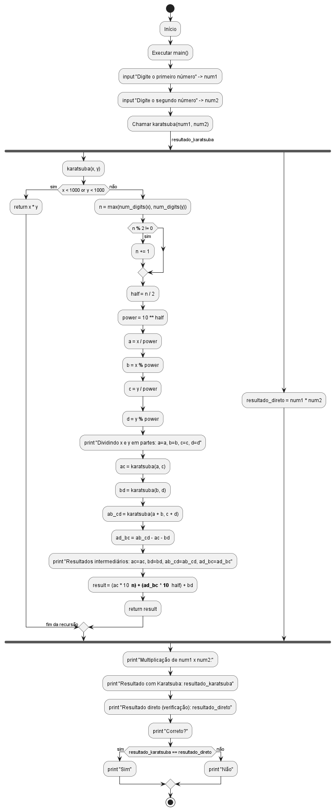

# Algoritmo de Karatsuba  

## Descrição  

Este projeto implementa o **Algoritmo de Karatsuba**, uma técnica eficiente para multiplicação de dois números inteiros grandes. O método reduz a complexidade da multiplicação de **O(n²)** para aproximadamente **O(n^1.585)**, tornando-o mais eficiente que a multiplicação tradicional para números grandes.  

## Funcionamento do Algoritmo  

O Algoritmo de Karatsuba segue os seguintes passos:  

1. **Caso Base**: Se os números possuem apenas um dígito, a multiplicação é feita diretamente.  
2. **Divisão**: Os números são divididos ao meio:  
   - \( x = 10^m \cdot a + b \)  
   - \( y = 10^m \cdot c + d \)  
3. **Recursão**: São realizadas três multiplicações menores:  
   - \( ac \)  
   - \( bd \)  
   - \( (a+b)(c+d) - ac - bd \)  
4. **Combinação**: Os resultados são combinados para obter o produto final:  
   \[
   resultado = (ac \times 10^{2m}) + ((a+b)(c+d) - ac - bd) \times 10^m + bd
   \]  

## Estrutura do Projeto  

O repositório contém os seguintes arquivos:  

```
📂 karatsuba-project  
│── 📄 main.py              # Implementação do algoritmo  
│── 📄 README.md            # Documentação do projeto 
│── 📄 mainTest.py          # Teste do algoritmo 
│── 📄 img.png              # Imagem do teste
│── 📄 img_2.png            # Representação gráfica do algoritmo
│── 📄 GraficoDeFluxo.png   # Grafico de fluxo
│── 📄 GraficoDeFluxo.puml  # Código do grafico de fluxo

```

## Como Executar  

### 1. Clonar o Repositório  

```sh
git clone https://github.com/DaviAguilar/trabalho_individual_1_FPAA.git
cd trabalho_individual_1_FPAA
```

### 2. Executar o Script  

```sh
python main.py
```

### 3. Exemplo de Uso  

Entrada:  
```
Digite o primeiro número: 556677  
Digite o segundo número: 889922
```
Saída esperada:  
```
Digite o primeiro número: 556677
Digite o segundo número: 889922
Dividindo 556677 e 889922 em partes: a=556, b=677, c=889, d=922
Dividindo 1233 e 1811 em partes: a=12, b=33, c=18, d=11
Resultados intermediários: ac=216, bd=363, ab_cd=1305, ad_bc=726
Resultados intermediários: ac=494284, bd=624194, ab_cd=2232963, ad_bc=1114485
Multiplicação de 556677 x 889922:
Resultado com Karatsuba: 495399109194
Resultado direto (verificação): 495399109194
Correto? Sim
```


# Análise da Complexidade do Algoritmo de Karatsuba

A seguir, a análise da **complexidade ciclomática** e **assintótica** do código .

<details>
<summary><strong>Clique para expandir a análise detalhada</strong></summary>

## 1. Complexidade Ciclomática

A complexidade ciclomática mede o número de caminhos independentes em um programa, sendo calculada como:  
**CC = E - N + 2P**  
- **E**: Número de arestas no grafo de controle.  
- **N**: Número de nós no grafo de controle.  
- **P**: Número de componentes conectados (geralmente 1 para uma função única).  

### Estruturas de controle na função `karatsuba`:
- **Condição `if x < 10 or y < 10`**: 1 ponto de decisão (2 caminhos).  
- **Condição `if max_length % 2 != 0`**: 1 ponto de decisão (2 caminhos).  
- Não há loops ou condições aninhadas complexas.  

### Análise:
- Fluxo básico + 2 decisões = **complexidade ciclomática ≈ 3** por chamada.  
- A recursão não é diretamente contabilizada, mas impacta a análise assintótica.

---

## 2. Complexidade Assintótica

A análise considera o tempo de execução em função do número de dígitos (**n**) dos números `x` e `y`.

### Passos do algoritmo:
1. **Caso base (`if x < 10 or y < 10`)**:  
   - Multiplicação direta: O(1).  
2. **Divisão dos números**:  
   - Conversão para string e preenchimento: O(n).  
   - Extração de partes (`a`, `b`, `c`, `d`): O(n).  
3. **Chamadas recursivas**:  
   - Três chamadas: `karatsuba(a, c)`, `karatsuba(b, d)`, `karatsuba(a + b, c + d)`.  
   - Cada uma opera em números de tamanho ≈ n/2.  
4. **Operações adicionais**:  
   - Somas e subtrações: O(n).  
   - Combinação final: O(n).  

### Recorrência:
\[ T(n) = 3T(n/2) + O(n) \]  
- **3T(n/2)**: Três subproblemas de tamanho n/2.  
- **O(n)**: Trabalho linear fora da recursão.  

#### Teorema Mestre:
- \( a = 3 \), \( b = 2 \), \( f(n) = O(n) \).  
- \( n^{\log_b a} = n^{\log_2 3} \approx n^{1.585} \).  
- \( f(n) = O(n^1) < n^{1.585} \), logo:  
  **T(n) = O(n^{\log_2 3}) ≈ O(n^{1.585})**.

### Complexidade de espaço:
- Espaço para variáveis: O(n).  
- Pilha de recursão: O(log n) níveis, cada um O(n).  
- **Total**: O(n log n).

---

## Resumo
- **Complexidade Ciclomática**: ≈ 3 por chamada.  
- **Complexidade Temporal**: O(n^{1.585}).  
- **Complexidade Espacial**: O(n log n).  

O algoritmo é mais eficiente que a multiplicação ingênua (O(n²)), mas operações de string adicionam overhead prático.

</details>


## Grafico de Fluxo
<details about="Clique para ver o gráfico de fluxo"> 
<summary><strong>Clique para ver Gráfico de Fluxo</strong></summary>
   <h3>Gráfico de Fluxo</h3>
   
</details>


# Diagrama de Fluxo do Algoritmo de Karatsuba

<details>
<summary><strong>Clique para ver a explicação do gráfico de fluxo</strong></summary>

<h3>Fluxo Geral</h3>
<ol>
  <li><b>Início:</b> Executa <code>main()</code>.</li>
  <li><b>Entrada:</b> Usuário insere <code>num1</code> e <code>num2</code>.</li>
  <li><b>Cálculo:</b> Chama <code>karatsuba(num1, num2)</code> → <code>resultado_karatsuba</code>.</li>
  <li><b>Verificação:</b> Calcula <code>num1 * num2</code> → <code>resultado_direto</code>.</li>
  <li><b>Saída:</b> Exibe resultados e verifica se são iguais.</li>
  <li><b>Fim:</b> Programa termina.</li>
</ol>

<h3>Função <code>karatsuba(x, y)</code></h3>
<ol>
  <li><b>Caso Base:</b> Se <code>x < 1000</code> ou <code>y < 1000</code>, retorna <code>x * y</code>.</li>
  <li><b>Pré-processamento:</b>
    <ul>
      <li>Calcula <code>n = max(num_digits(x), num_digits(y))</code>.</li>
      <li>Se <code>n</code> for ímpar, incrementa <code>n += 1</code>.</li>
    </ul>
  </li>
  <li><b>Divisão:</b> Calcula <code>half = n / 2</code>, <code>power = 10^half</code>, divide em:
    <ul>
      <li><code>a = x / power</code></li>
      <li><code>b = x % power</code></li>
      <li><code>c = y / power</code></li>
      <li><code>d = y % power</code></li>
    </ul>
  </li>
  <li><b>Depuração:</b> Imprime <code>"Dividindo x e y em partes: a=a, b=b, c=c, d=d"</code>.</li>
  <li><b>Recursão:</b>
    <ul>
      <li><code>ac = karatsuba(a, c)</code></li>
      <li><code>bd = karatsuba(b, d)</code></li>
      <li><code>ab_cd = karatsuba(a + b, c + d)</code></li>
      <li><code>ad_bc = ab_cd - ac - bd</code></li>
    </ul>
  </li>
  <li><b>Depuração:</b> Imprime <code>"Resultados intermediários: ac=ac, bd=bd, ab_cd=ab_cd, ad_bc=ad_bc"</code>.</li>
  <li><b>Resultado:</b> Combina: <code>(ac * 10^n) + (ad_bc * 10^half) + bd</code>.</li>
  <li><b>Retorno:</b> Retorna o resultado.</li>
</ol>
</details>


## Teste
<table>
   <tr>
        <td>
            
         </td>
   </tr>
</table>


— **Erro esperado na multiplição x=123, y=456**

## Referências

<div align="center">
   <table>
      <tr>
         <td>
            <a href="https://en.wikipedia.org/wiki/Karatsuba_algorithm">
               Karatsuba algorithm
               <br>
               
            </a>
         </td>
         <td>
            <a href="https://www.geeksforgeeks.org/karatsuba-algorithm-in-python/">
               Karatsuba algorithm in Python - GeeksforGeeks
               <br>
               
            </a>
         </td>
      </tr>
   </table>
</div>


## Versão do Python  

Este projeto foi testado com **Python 3.10+**.  


## Estatísticas do Projeto

[](https://wakatime.com/badge/user/7beb7eb7-4987-4618-bc90-5459c6351da6/project/6f761fe6-7a41-47a7-8e52-1267faee5fd1?style=flat-square)

